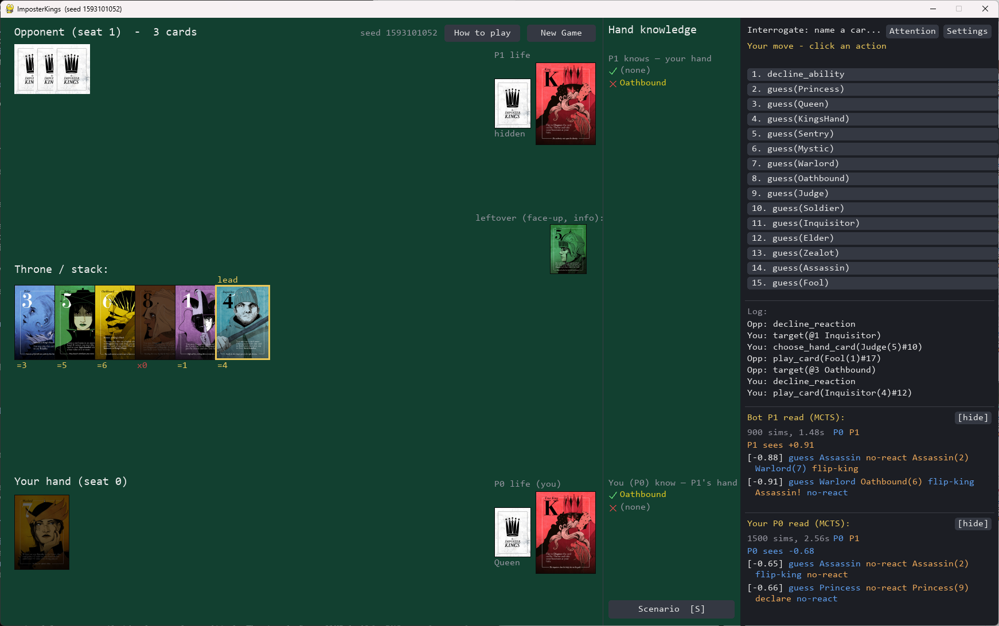
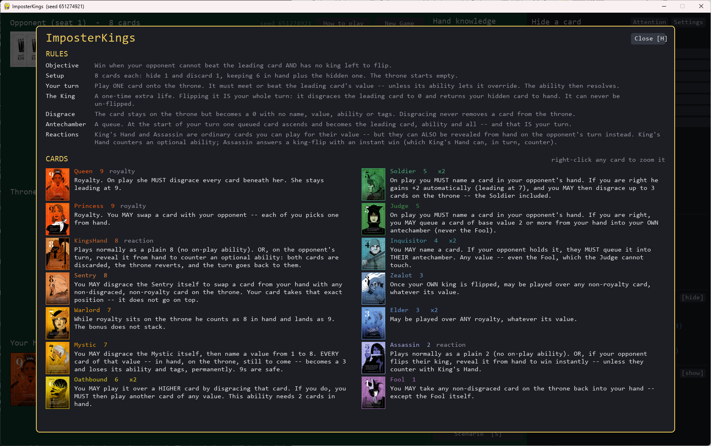
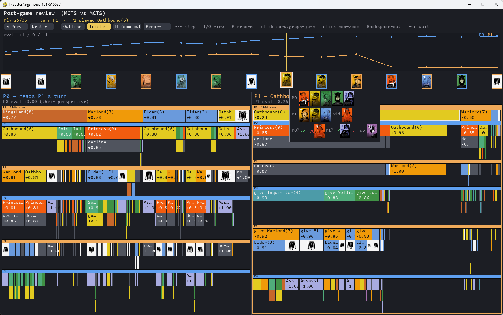
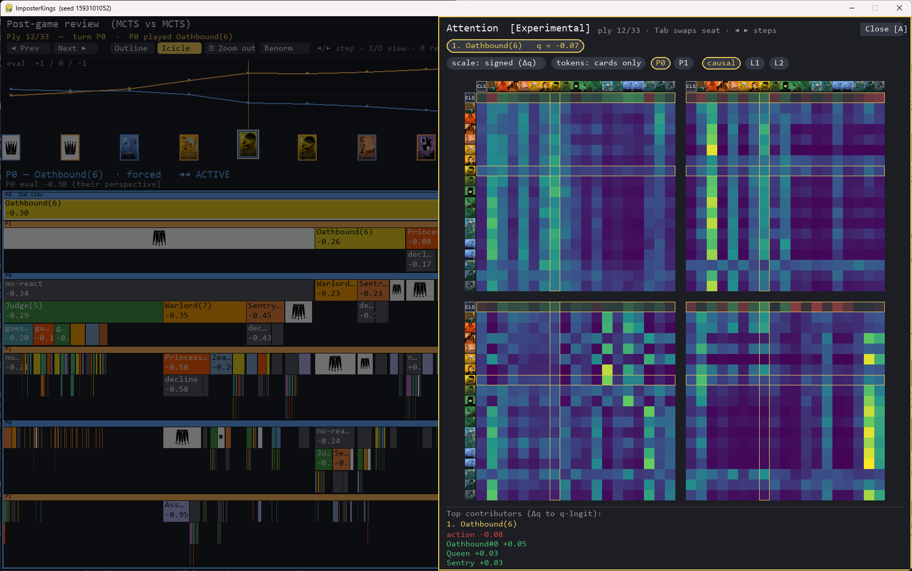

# ImposterKings

A Python build of the 2-player card game **ImposterKings**, and an AI solver
for it: a pure rules engine, a Single-Observer Information-Set MCTS bot, neural evaluators (MLP and an
**explainable attention net**), and a PyGame frontend that will show you *why* the bot played what it played.



The interesting part of this game is that it is **imperfect-information**: you never see the opponent's hand,
abilities let you *guess* at it, and a turn is not one decision but a nested sequence of them. That shape
drives every design choice below.

## Rules


---

## How to set up

### Just play it

Unzip `ImposterKings-release_1.zip` and run **`ImposterKings.exe`**. No Python, no install, ~29 MB. 
see [ImposterKings-release_v1](https://github.com/Danielsrq/ImposterKings-Bot/releases/tag/v1.0)

Note that playing with using a Python Environment would use pytorch to perform model forward passes. The pre-built windows exe converts everything to numpy (because shipping torch would be gigabytes large.) The pre-built exe ships with an MLP-256 model and an action-in transformer model.

Switch the bot's engine and model
live in **⚙ Settings**; press **A** for the attention panel, **H** for the rules.

> Windows SmartScreen will warn about an unsigned executable. That is expected — the build is not code-signed.

### From source

```bash
python -m venv .venv
.venv\Scripts\python -m pip install -e ".[dev,ui]"      # dev = pytest, ui = pygame
```

`numpy` is the only hard dependency — the engine, the search and the shipped `.npz` nets all run on it. The
extras are opt-in: `ml` (torch — needed to **train**, and to load the dev `.pt` checkpoints; the released
`.npz` nets need no torch at all) and `analysis` (tqdm/matplotlib/joblib, for the self-play studies).

```bash
# Play in a window; the opponent is a bot
python -m imposterkings.ui.app

# Post-game review of a bot-vs-bot game (icicle trees, eval graph, attention drawer)
python -m imposterkings.ui.review --seed 0
```

The bot's budget is per-decision rather than a flat iteration count (see *Search*, below):

```bash
python -m imposterkings.ui.app --p1 hybrid --k 20 --l 3     # the default
python -m imposterkings.ui.app --nn models/mlp_256.pt       # NN+MCTS with a torch checkpoint
```

### Scenario builder

Rather than hunting for a seed that reaches some position, build the board directly — then play it, or drive a
scripted line and render the review to PNG. Useful for pinning exact rules interactions (a King's-Hand counter,
say) in tests.

```bash
python -m imposterkings.ui.app --setup      # or press S in-game
```

```python
from imposterkings import scenario as sb
st = sb.build(hand0=["Oathbound", "Inquisitor"], hand1=["Elder", "KingsHand"],
              stack=["Sentry"], turn_player=0)          # stack top = the leading card
```

See `scenario.py` and `ui/headless.py` for the scripted-trajectory and PNG-capture helpers.

---

# AI-Solver Overview

This section is for the AI geeky stuff - Not just NN models but also traditional AI like tree-search. In fact both are used. 

## Information Set Monte Carlo Tree Search
The main engine uses Single Observer Information Set Monte Carlo Tree Search SO-ISMCTS **SO-ISMCTS** (Cowling et al., 2012): re-determinize at the root every iteration, then descend in lockstep with that concrete world, using availability-weighted UCB1 so that moves which are only *sometimes* legal are compared fairly. An information set (IS) is the world as perceived by one player. Since he cannot tell what the hidden information is, an IS is the world fully described by the information he knows. As such many game states might fall within the same IS.

The budget is sized per decision, not fixed, because branching varies wildly across a turn:

```
hybrid    = clamp(k * eff_legal(l) * (1 + opp_cards), 64, 4096)     # branching + hand uncertainty
branching = clamp(k * eff_legal(l), 64, 4096)
```
As per usual MCTS methods, the node (play) with the highest visits is chosen as the candidate move. Each node performs a rollout of a random game being played with a score of +1 (win) or -1 (loss). This score is backpropagated.

With a neural network evaluator attached, selection switches to **PUCT** and the random rollout is replaced by the
net's value — AlphaZero-style, same tree code.

### Weaknesses of ISMCTS
ISMCTS on hidden information game has a theoretical weakness of strategy fusion. It computes the best outcomes as an expectation of a set of unique worlds. This is a direct result of determinizing each hand when performing a rollout. To illustrate this, we consider the world according to only 1 player (called an IS) where if the opponent has the Queen he should play A else he should play B. This is a 50/50 scenario - The expected outcome from his play is a statistical mix (inbetween -1 and 1) however this loses a lot of nuance to the position. 

### CFR
The "correct" way to handle hidden information is CFR counterfactual regret minimisation. However as the standard 2-player variant of imposter kings is an "almost-perfect" information game CFR is spatially intratable. I did a counting test and in 128k plays made from random games over 97% of plays were unique. In other words the total count of infomation sets are too numerous to track. I might tackle this another time.

## The AI Models

Two evaluators, both usable as an MCTS leaf head:

| | params | what it is |
|---|---:|---|
| **MLP** | 55.8 K | flat feature vector → q. Fast, and the strength baseline. |
| **Attention** | **108.7 K** | d=64, 2 layers, 4 heads. The boardgame is **24 tokens**: `[CLS, 18 card instances, 2 kings, board, phase, action]`. |

The attention net's featurization is the point. The 18 card tokens are **the deck itself**, not the visible
cards — so a card you *haven't* seen is still a token, carrying a **zone posterior** (where the model believes
it is). The model can therefore attend to *absence*, which is most of the information in a hidden-hand game.
It is an action-in q-net: the candidate move is a token, so one forward pass scores one (state, action) pair.

**Honest result: the attention net plays with similar strength to the MLP, not better** — and costs ~3× the CPU. Its value is not strength; it is that you can *read* it.

I've tried treating only played cards as tokens. This still worked but converged less well. There was a bit of an explainability issue because the attention model could not express fear of unseen cards in this tokenization.

### Featurization (`machine_learning/features2.py`)

The sequence is **S = 24**, fixed every ply — `[CLS] + 18 cards + 2 kings + board + phase + action`. Each token
*kind* has its own `Linear(native → d=64) + LayerNorm`, so they can carry completely different fields and still
share one attention space. There is **no positional encoding**: this is a *set*, and a token's meaning lives in
its features, not its slot.

| token | count | dims | fields |
|---|---:|---:|---|
| **CLS** | 1 | 64 | learned readout vector (no projection). Its final row is the q-head's input. |
| **card** | 18 | **46** | see below — one token per *deck instance*, seen or not |
| **king** | 2 | **4** | `owner mine/theirs (2) · flipped · flip_legal_now` |
| **board** | 1 | **4** | `both hand sizes (2) · is_my_turn · is_reaction_window` |
| **phase** | 1 | **15** | one-hot over `StepKind` — *which* micro-decision is being asked |
| **action** | 1 | **51** | `kind (14) · card (14) · guess (14) · number (8) · target (1)` — the candidate move |

The **card token (46)** is where the game actually lives:

| slice | dims | meaning |
|---|---:|---|
| name | 14 | one-hot over the 14 card names |
| power · base | 2 | current value / printed value, each ÷ 9 |
| mechanics | 8 | ability signature: `is_royalty · is_reaction · optional_onplay · guess · heavy · stack_target · mute · followup`. Zeroed when the card is **muted** — a muted card genuinely has no ability, and the model sees that directly. |
| state | 10 | `is_muted · disgraced · is_leading · stack_depth · is_legal_now · is_candidate_action · pending_selected · pending_source · pending_guess_target · pending_mute_target` |
| **zone posterior** | **12** | a *distribution* over `my_hand · my_hidden · my_setup · their_hand · their_hidden · their_setup · my_ante · their_ante · stack · discard · faceup · facedown` |

The last row is the whole idea. For a card you can see, the posterior is a **delta** (it *is* on the stack). For
one you cannot, it is a **spread** over the hidden zones, narrowed by everything you have deduced — a guess that
came back "no Elder" removes mass from `their_hand`. So the belief state is not a separate module bolted on: it
is a *feature*, and the attention head can look straight at it. That is what lets the drawer answer "which card
is it *afraid* of", not merely "which card did it look at".

The MLP (`features.py`) flattens broadly the same information into a single 216-dim vector — same facts, no
structure, and no way to ask which part of it mattered.

### Explainability

The game provides 2 forms of explainabiltiy. First the classic Principle Variation method similar to chess.

## Principle Variation


We show the game trajectory and the relative evaluation of the state of the game which are reached by the actions played. The icicle plot shows the tree search evaluations and the bot will pick the box with the largest width i.e. most number of visits. Note that the graphs are not negatives of each other because this is a hidden information game. It is possible that both players simultaneously have the belief they are winning or losing.

The review screen steps ply by ply with the search tree drawn as an icicle, both players' evaluations on one
graph, and `Tab` to swap whose read you are looking at.

## Attention Matrix
Press **A**, in-game or in the review. Every ply is explained: the per-head CLS→token attention (which cards
the model looked at), a **signed contribution** per token (how much each one moved the q-value, decomposed
through the readout direction), and the zone posteriors for unseen cards. At L=2 the drawer routes causally —
only layer 1's card rows actually feed layer 2's CLS, so it shows you the path that really carries gradient,
not the rows that get computed and discarded. The method used here to decompose contribution is called Direct Logit Attribution (DLA) and was adapted from *Attention is Not Only a Weight: Analyzing
Transformers with Vector Norms, Kobayashi et al (2020)* and *A Mathematical Framework for Transformer Circuits, Elhage et al. Anthropic (2021)*



The model has 4 attention heads and hence 4 boxes in the attention panel. This is just what the model sees to compute its evaluation. A word of caution: it offers some interprebilty but is still quite opaque. This was nevertheless still a fun project for explainable AI. Just because the model looks at the token doesn't mean it will play that token, just that it factored them into consideration.
In particular attention head 4 (bottom right corner) seems to be the "fear" attention head. It is very weary of potential threats especially of the unknown. From the screenshot the two rightmost column represent the (unseen) assassin and fool and they have the brightest column.
Other notable behaviours are that in general the assassin, princess and queen are the brightest tokens on the heat map which probably alludes to its strength in the game.
Note also that behaviour of the attention heads are emergent i.e. I did not (could not) dictate how each attention head should specialise; it learnt entirely from a dataset of played games.

The full experimental record, including the runs that failed and why, is in
[`machine_learning/attention_exploration.md`](src/imposterkings/machine_learning/attention_exploration.md).

### Layout

| Module | Role |
|---|---|
| `cards` · `rules` · `actions` | card registry (18 instance ids), tunables, the `Action` type |
| `abilities` · `state` · `generate` | the resolution-stack state machine; `legal_moves` per decision point |
| `infoset` | projection + knowledge-aware `determinize` — the MCTS seam |
| `mcts` · `agents` · `budget` · `rng` | SO-ISMCTS, the per-decision budget policies, the search RNG |
| `machine_learning/` | featurization, datasets, training, the nets, `explain`, and the numpy inference core |
| `data_analysis/` | self-play datagen, scaling studies |
| `ui/` | PyGame frontend: board, review (icicle), attention drawer, scenario builder |
| `packaging/` | PyInstaller spec + the build script |
